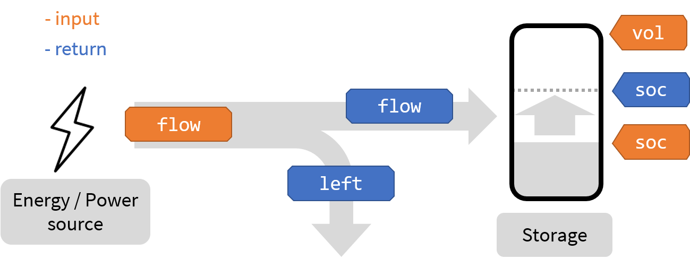

# Distribute

`distribute()` describes how an energy flow interacts with a one or more energy storages. 

It is lower-level than other `eflows` functions, and it cares only about initial and final values (no timeseries involved). It can be used individually, and it is also called internally by higher-level functions like `simulate()` to describe how the state of charge of storages evolve over time. 

The function has three compulsory parameters: `flow` (of energy), `soc` (the initial state of charge of the storage) and `vol` (the desired state of charge at the end of the interaction; normally the maximum capacity of the storage).

The return is a list of three values: `soc` (the actual state of charge after the interaction), `flow` (the actual amount of energy that interacts with the storage) and `left` (the "leftover" energy (hasn't interacted), if any). 

As in other `eflows` functions, the unit of `distribute()` arguments is not especified. A good default is kWh, both for the energy flow and the storage. 



In it simplest application, `distribute()` feels trivial. `eflows::distribute(flow = 30, soc = 40, vol = 80)` means that a flow of 30 (kWh) is introduced in a storage of 80 kWh that is charged up to 40 kWh. As a result, the function informs that `flow` is 30 (all the energy ends up in the storage), `soc` is 70 (the initial state of charge plus the flow) and `left` is 0 (there is no "leftover" energy, it all interacts with the storage).

As a first step in complexity, if `flow` is larger the available capacity in the storage, `left` is higher than zero:

```
eflows::distribute(flow = 100, soc = 40, vol = 80)
#> $soc
#> [1] 80
#> 
#> $flow
#> [1] 40
#> 
#> $left
#> [1] 60
```

One of the keys of `distribute()` is its capacity to manage progressively complex scenarios through a number of additional parameters. For instance, `eff` reflects the efficiency of the storage when assimilating energy:

```
eflows::distribute(flow = 100, soc = 40, vol = 80, eff = 0.85)
#> $soc
#> [1] 80
#> 
#> $flow
#> [1] 47.05882
#> 
#> $left
#> [1] 52.94118
```
Note that when `eff` is smaller than 1, `left` is reduced, because part of the energy is dissipated in conversion losses while filling up the storage.  

The parameter `cap` indicates the maximum amount of energy that can be assimilated by the battery (in the timespan considered):

```
eflows::distribute(flow = 100, soc = 40, vol = 80, cap = 30)
#> $soc
#> [1] 70
#> 
#> $flow
#> [1] 30
#> 
#> $left
#> [1] 70
```
In the case the resulting `flow` cannot be larger than 30, because it is limited by `cap`.

Note that different parameters can be used at the same time; for instance, by using both `eff` and `cap`:

```
eflows::distribute(flow = 100, soc = 40, vol = 80, eff = 0.85, cap = 30)
#> $soc
#> [1] 65.5
#> 
#> $flow
#> [1] 30
#> 
#> $left
#> [1] 70
```
`flow` is still 30, but the resultant `soc` is 65.5 instead of 70, because 15% of the energy was lost in the process.


### `distribute()` is vectorized

The arguments of `distribute()` can be not just on a single value, but on a whole vector of values at the same time. 

This means that by passing a vector of length `n` to each parameter (except `flow`), `n` storages can be managed simultaneously. The parameters of the  storage 1 are placed as the 1st of each vector, the arguments of the storage 2 are the 2nd of the vectors, and so on. 

```
eflows::distribute(flow = 90, 
         soc = c(40, 50, 30), 
         vol = c(80, 90, 70))
#> $soc
#> [1] 70 80 60
#> 
#> $flow
#> [1] 30 30 30
#> 
#> $left
#> [1] 0
```
It is possible to control what storages are charged first. The parameter `share` indicates the proportion of `flow` that shall go to each storage.

```
eflows::distribute(flow = 90, 
         soc = c(40, 50, 30), 
         vol = c(80, 90, 70), 
         share = c(0.4, 0.25, 0.35))
#> $soc
#> [1] 76.0 72.5 61.5
#> 
#> $flow
#> [1] 36.0 22.5 31.5
#> 
#> $left
#> [1] 0
```

If an storage has a `share` of zero, it is served only *after* the energy flows to the other storages have been resolved. 

```
eflows::distribute(flow = 90, 
         soc = c(40, 50, 30), 
         vol = c(80, 90, 70), 
         share = c(0, 0.25, 0.35))
#> $soc
#> [1] 50 90 70
#> 
#> $flow
#> [1] 10 40 40
#> 
#> $left
#> [1] 0
```

The parameter `level` offers finer control over the storage charging priority. *Higher levels resolve first*, and if there is some `left`, this is resolved in successive lower levels. 

```
eflows::distribute(flow = 60, 
         soc = c(40, 50, 30), 
         vol = c(80, 90, 70), 
         level = c(3, 2, 1))
#> $soc
#> [1] 80 70 30
#> 
#> $flow
#> [1] 40 20  0
#> 
#> $left
#> [1] 0
```

Last, `active` especifies if the storage actually participates in the energy allocation, regardless of `share` and `level`.

```
eflows::distribute(flow = 100, 
         soc = c(40, 50, 30), 
         vol = c(80, 90, 70), 
         share = c(0.8, 0.1, 0.1),
         level = c(3, 2, 1),
         active = c(FALSE, TRUE, TRUE))
#> $soc
#> [1] 40 90 70
#> 
#> $flow
#> [1]  0 40 40
#> 
#> $left
#> [1] 20
```


### Discharging

`distribute()` can also be applied to storage discharge. To express discharge instead of charge:

- `flow` shall be negative.
- `vol` shall be zero (if the desired result is total discharge).

```
eflows::distribute(flow = -100, 
                   soc = c(40, 50, 30), 
                   vol = c(0, 0, 0))
#> $soc
#> [1]  0 0 0
#> 
#> $flow
#> [1] -40 -50 -30
#> 
#> $left
#> [1] -30
```
Note that the parameter `vol` can also be higher than zero if the desired output is a *partial discharge*:

```
eflows::distribute(flow = -100, 
                   soc = c(40, 50, 30), 
                   vol = c(10, 40, 30))
#> $soc
#> [1]  10 40 30
#> 
#> $flow
#> [1] -30 -10   0
#> 
#> $left
#> [1] -60
```
