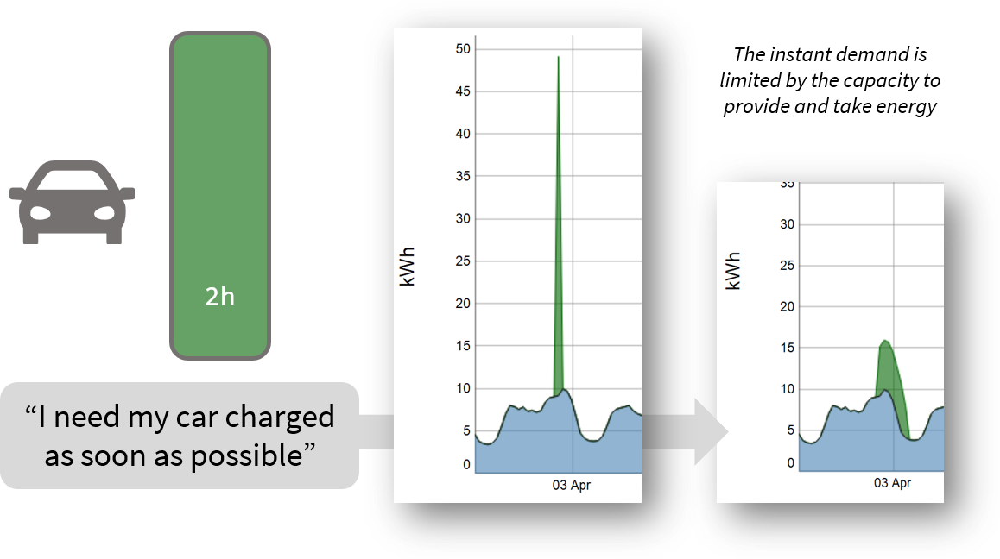
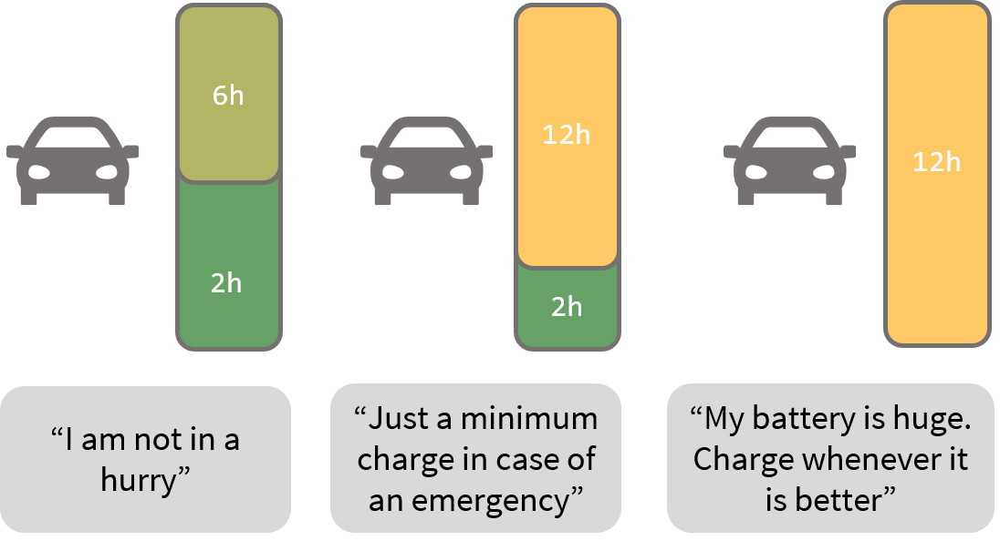

# Electric Vehicle charging

Electric vehicles (EVs) are one of the first cases for the application of eflows; they are a "low hanging fruit" when managing the demand side management of the EMS. 

The optimization is done by commanding either the EV or the charging pole to charge at a given power, or to halt the charge if appropiate. The optimization of the charge comes in two varieties, depending on the objective: 

- Charge a certain amount of energy within a timeframe, allocating the charge in the moments when it is the most beneficial.

- Charge as fast as possible given a certain available power, and distribute the charging load in the best possible way among cars. 

eflows considers both cases. The first one makes use of `foresehift()`, while the second uses `distribute()`

## Optimize allocation of energy within a timeframe

This is the sort of optimization like "I need to have my car charged by tomorrow morning. When exactly is charged over the night, I do not care". 

Particularly, this is an example of foreshifting where the demand is *punctual* in time, namely, when the EV is connected to the charging point.

In the "business as usual" scenario, the energy requirements of the EV can be conceptualized as a punctual peak of demand, with little to zero flexibility. At that monent in time, the EV *demands* a certain amount of energy, although such theoretical peak is never realized because there are technical limitations to the power that can be assimilated, either by the side of the EV or the charging pole. The resulting profile of demand is thus a high consumption sustained over time, until the battery is filled, moment in which the demand is over. 

Controlling the flow of electricity towards the EV is useful because more often than not, the time at which an EV finishes to charge is way earlier than when the EV is needed. In other words, if an EV is needed at 7:00 AM and finishes to charge at midnight, there are seven hours of potential flexibility that could have been used to optimize the energy flows (doing peak shaving, optimizing for renewable energy consumption, or other cases).

It is often the case that a user is indifferent to when the EV will be charged overnight, but he or she will find important to have a minimum or charge in the car, a "just in case" capacity, to be ready to go. One of the main features of `foreshift()` is that it allows several deadlines for different amount of energy required by the same object and point in time; then, it is easy to define a charging profile that considers this need for fast charging, while also optimizing the energy consumption to fill the rest of the battery, with more flexibility. 

At the far end of the flexibility, there are users that will not mind to have their battery fluctuating between half-charged and full-charged, meaning the requirements for charging can be fulfilled at any time in, perhaps, up to 24 hours. Many user cases will fall in between. 

