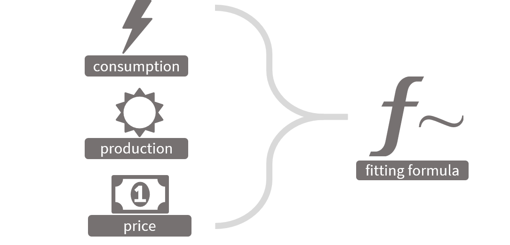
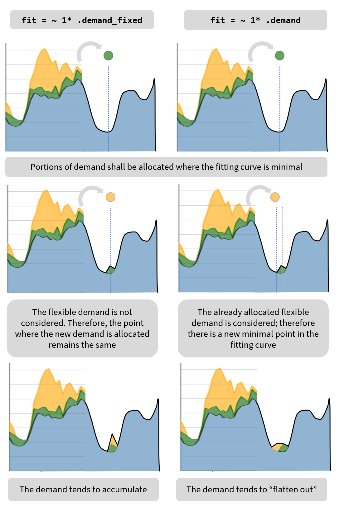

The graph above is generated as follows:

- The several inputs are combined into a *fitting formula*.
- The fitting formula, applied to the actual data of the `e_frame` object, defines the *fitting curve* for the graph.
- In function of the fitting formula and the fitting curve, `foreshift()` allocates the flexible demand so the lowest points of the fitting curve are allocated energy in the first place. 

## Fitting formula

In the eflows framework, a fitting formula is a mathematical representation of *what is important to optimize* when timeshifting energy demand.

A fitting formula is very flexible and can take any number of user-defined variables. For the sake of usability, the most important factors within an `e_flow` object are already available to use them directly:

- `.demand_fixed`: it reflects the demand that is *fixed* (it cannot be reallocated in time).
- `.demand` : represents the *total demand*, namely, the sum of fixed demand and flexible demand. This variable is special because it *changes as `foreshift()` or `backshift()` is executed*. As described below, it acts as a *feedback mechanism* to limit the amount of energy that is allocated at a certain point in time.  
- `.production_fixed`: It is the sum of all the production that is deemed fixed (renewable energy is fixed because, unlike energy from fossil fuels, cannot be produced on demand).
- `.price`: self-explanatory; this is the vector of energy price defined by `e_frame$set_price()`.
- `.cap`: indicates the grid capacity. Remarkably, using `e_frame$set_cap()` is not enough to consider `.cap` in the formula. It has to be explicitly used.

Following R conventions, the fitting formula is prefixed by `~`. Then, in its simplest shape it takes a form like `~ 1* .price`. This means that, at any given moment, the flexible demand shall be allocated where the price of the energy is the cheapest.

Note that to maximize the consumption of renewable energy the formula should be `~ -1* .production_fixed`; *negative*, because we want to allocate the demand when `.production_fixed` is the highest, not the lowest. In the case of `~ 1* .demand` the flexible demand will be allocated where the total demand is the lowest, but here is the catch: the point in time where `.demand` is the lowest will change as new demand is allocated. 

## Fitting curves and `.demand` as feedback mechanism

`foreshift()` and `backshift()` work by gnawing away the original flexible demand, and allocating the bits where the fitting curve is the lowest, of course considering *time constrains*: the demand that can be foreshifted 10 hours will only consider the lowest point in the fitting curve up to 10 hours into the future, not in the whole timeseries. 

At the start of the function execution, the fitting curve is determined by the fitting formula. At this point, the only demand that is allocated is the fixed one, so `~ 1* .demand_fixed` and `~ 1* .demand` will produce idential curves. 

Every time a new bit of demand is allocated, the fitting curve is updated. This has consequences if the formula includes `.demand`, because the previously allocated flexible demand will be included in the new calculation of the curve, and hence will influence where is the new lowest point. 

If the formula doesn't include `.demand`, the newly allocated demand will not affect the curve, nor the subsequent lower points in the curve.

This is why `.demand` acts a feedback mechanism. When the formula depends exclusively on it, it generates the "peak shaving profile"; when combined with other variables, it generates a "penalty factor" over those moments in time with a high amount of demand already allocated. 

Note that if used `.demand` in the formula, in addition to the *initial* fitting curve there will be a *final* fitting curve. The fitting curves are *adimensional*, in the sense that they can combine parameters that use different units. Instead, it is useful to talk about *utility* to express the importance of a number of parameters combined in the fitting curve. Therefore, one can say that the objective of `foreshift()` and `backshift()` is to *minimize the expense of utility*.

## Using `.cap` to include grid capacity

Let us suppose we want to use the formula `~ 1* .price`, while keeping the total energy demand below the grid capacity (designated by `.cap`). 

In this case the formula will be `ifelse(.demand < .cap, .price, NA)`. Note the conditional effect of `ifelse()`: *If* the demand is lower than the grid capacity, the fitting curve remains `.price`; *else* the fitting curve at that point becomes `NA` (not available).

A detail that I hadn't mention yet is that the demand is allocated in the lowest point *among finite values* of the fitting curve. Because `NA` values are not finite, this prevents them to be assigned more demand. 

Instead of `.cap` it can be used an integer, for instance: `ifelse(.demand < 60, .price, NA)`. The main advantage of using `.cap` instead is that it is easier to work programmatically with grid capacities that are variable in time.  

## Applying fitting formulas

Fitting formulas are remarkably powerful, allowing users to give preference to different factors in a procedural (non-predefined) way. 

By default only a selection of R functions can be used within the formula (it would be too easy to use `system()` to execute malicious code), yet this could be changed to include any number of functions, including user defined ones. 