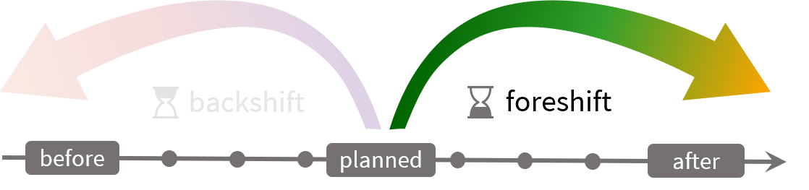

# Foreshift

Foreshift consists in the displacement towards the future of demand that would be instead consumed in the present. 

Time plays a vital role in eflows, yet the time series objects are not prefered. Instead, are used liberally data frames where the first column is time-based (and normally named "datetime"). This decision is taken for the sake of simplicity; a time series most of the times behaves like a data frame wehre the first column has different semantics. Where it is necessary to operate with actual time series, two helping functions to flip between data frames and time series are used: `df_to_ts` and `ts_to_df`

The energy flows are expressed on basis of kWh (the default unit to work with in the package), not kW or any other power unit. In principle kWh and kW are equivalent if the time step is one hour. This makes easier to read the changes in the battery: "25 kWh have flown, so the battery is charged with extra 25 kWh"
