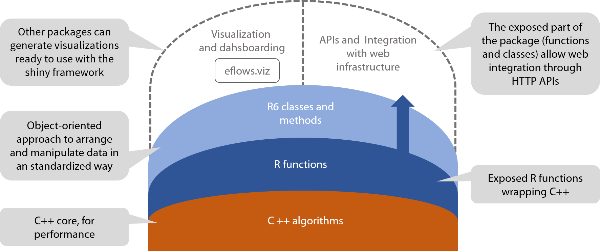

## Motivation

It is no secret that we are involved in the energy transition. A successful transition would involve to have control over the elements of the energy systems, to decide when do they consume (batteries, heat pumps, electric vehicles, smart appliances) and also when produce (in the case of biomass or CHP)  It is also evident that there is no "one size fits all" solution for coordinating such many elements of the energy system. 

`eflows` does not aim to be the "end-it-all" solution for energy systems because how the software interfaces with hardware is difficult enough. Instead, `eflows` can be a reproducible solution for working with the *data* of such EMS. 

The package offers a "high-level" object-oriented, meaning it is focus on making complex things with the minimum amount of code. Another way to put it is that the API is "declarative": the user *declares* what he or she wants without needing to know the details of the execution. 

The intention is to organize all the data relating an EMS in a highly structured `e_frame` object, and then apply "lower-level" functions over this data in an easy way. 

## Functional programming, object-oriented programming

R is a functional-oriented programming language, which means the object-oriented approach described above is unorthodox. `eflows` code often doesn't "feel" as R code. The main difference between the functional and the object-oriented coding approach is that in the later the variables are modified "on the fly", without the need of assigning them to new variables. 

This can make the code harder to understand because the context where the code is executed becomes more important. That said, `eflows` tries to minimize erros implementing methods that are "idempotent". Using the same method twice is the same as applying it once (for instance, using `e_frame$set_storage()` twice doesn't set two different storages in `e_frame`; the second application overrides the first one instead.)

While it is debatable if this approach is the right one, `eflows` uses a "classic" object-oriented approach (through the R package `R6`) for a couple of reasons: 

- The build and work of an `e_frame` object has to be quite strict. Using OO programming allows to encapsulate these operations in methods helps to clarify what can be done with the object. In addition, chaining methods allows to write more terse code.

- EMS software has been traditionally been developed in OO languages, like Java. This makes sense, considering that an EMS consists in putting together a number of *objects* with different properties. The intention of `eflows` is to feel familiar to those accustomed to OO programming. 

Ultimately, the objective is to use OOP and FP in a synergistic way; instead of being opposite poles in a gradient, both programming styles can reinforce each other by managing the complexity of EMS: organizing the data in objects, and then applying functions over them. 

## Structure

- A core of **C++ algortihms**: C++ is a low-level language, way more efficient than R. It is responsible of `eflows` speed. The algorithms (contained in functions) are very "imperative-style" oriented and use a weath of *for loops* that would be too slow in R instead. The algorithms do not include any form of machine learning or predictive modeling; indeed, by design `eflows` does not include any form of randomness in its calculations.  

- A first layer of **R functions**: R interacts with C++ thanks to the `Rcpp` package. These functions are more than a simple *wrap* around the C++ functions, because they often "preprocess" the inputs, verifying them and processing them so they can be used by the lower-level C++ functions. These R functions are exposed in `eflows` meaning they are properly documented and users can work directly with them if they prefer to skip the OO API. 

- A second layer of **R6 objects**: This is intended as the main API of `eflows`; the way by default users work with it. It includes a number of "tricks" to make easier to apply the underlying R functions. These functions are encapsulated in methods; for instance, `foreshift()` becomes the method `e_frame$do_foreshift()`. `foreshift()` requires a number of arguments. `e_frame$do_foreshift()` allows to apply the function without caring about the arguments, because these are fetched from within the `e_frame` structure.  

<div class="broadImage">

</div>

## Extending `eflows`

Another example of the OO approach is that `eflows` can be extended over the third layer. Because the structure of the `e_frame` objects is consistent, it is easy to design R packages build around functions that take as input an `e_frame` object, and then can refer to the data stored in the specific field of the object. 

This has several interesting possibilites for modularizing code. It could make very easy to relay instructions to specific devices based on the outputs of an `e_frame` object, and it would allow to interact with `eflows` directly though an HTTP API, using the OpenCPU framework (a possibility to be researched). 

`eflows.viz` is an example of this way of working. The idea is to separate concerns: `eflows` takes care of the computation, and `eflows.viz` concerns the visualization. 

## The`e_frame` object
`eflows` uses a custom object, called `e_frame`, to organize the relevant data to work with. The object has several fields, each one roughly representing one element of the energry system (production, consumption, storage, infrastructure, ect.). Each field has two subfields: *input* and *output*.

The *input* subfields are populated using a custom method for each field (`e_frame$set_demand()`, `e_frame$set_storage()` and so on). Many times, the data introduced with be time-based vectors. The time series itself is defined at initializing the object, and then vectors of the same length (to express *demand over time* or *production over time*, for intance) are passed into the methods. In the case of doing real-time steering, the time series would start in the present moment, and then extend into the future. This means that to know *demand over time* or *production over time* it would be needed a work of predicting them. 

In any case, the time-based data is *left aligned*. This means that the changes in flows and storages SOC reflect the change of the system once that time step has been concluded. In an hourly-based simulation, the flows that correspond to 14:00 are the ones happened between 14:00 and 15:00, and the SOC of the batteries reflect their status once these energy flows have been resolved. 

While initializing an `e_frame` object, it is possible to especify the unit employed, by default *kWh*. Note that this is an energy unit, not a power one. Instead of working with power, it is possible to pass it to energy depending on the timestep of the timeseries used. A power source of 10 kW will produce a constant energy flow of 10 kWh if the timestep is one hour, or 2.5 kWh if the timestep is 15 minutes.  

A typical workflow consists in initializing the `e_frame` object, populate the *input* subfields with the relevant data, and then apply an algorithm that stores the results in the same object, in the *output* subfields.

The following example contains four statements, that use the dataset `eflows::sept`:

```
testframe <- e_frame$new(sept$datetime[1:168])

testframe$set_demand(e_demand$new(fixed = (sept$d_house_smooth[1:168]),
                                  flex = list(flex_mtx$new(data = as.matrix((rep(0.03,168))),
                                                           steps = 4))))

testframe$set_production(e_production$new(fixed = list(solar = sept$solar[1:168])))

testframe$do_foreshift(fit = ~ .demand - .production_fixed)
```
1. Initialize the `e_frame` object. At this step it is convenient to setup few features of the `e_frame`, particularly the time series to use. 

2. Use the method `e_frame$set_demand()` to populate the field `testframe$demand$input`. Note how it is usd a custom object (`e_demand`, described shortly in LINK) that distingishes between fixed demand and flexible one. 

3. Use the method `e_frame$set_production()` to populate the field `testframe$production$input`.

4. Use the method `e_frame$do_foreshift()`, to apply `foreshift()` using the data already stored in the project (the method is a wrapper around the lower-level function). Note how `fit = ~ .demand - .production_fixed` expresses the objective of hte optimization [LINK]. Try to use `fit = ~ 1*.demand` to instead do peak shaving. 

Once the `e_frame` has been processed, it still contains all the initial information (*input*) and the results of the calculation (*output*). This allows to easily build over these `e_frame` objects, using them as input to functions that can access their fields to generate new results or side effects. 

For instance, the package `eflows.viz` is built around the idea of reading `e_frame` objects and generate web-ready graphs. `eflows.viz::viz_fore_input(testframe)` will show the data of `testframe` before it is foreshifted, while `eflows.viz::viz_fore_output(testframe)` will show it for the already processed data. 

